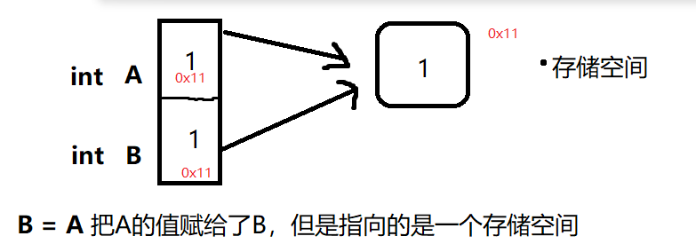
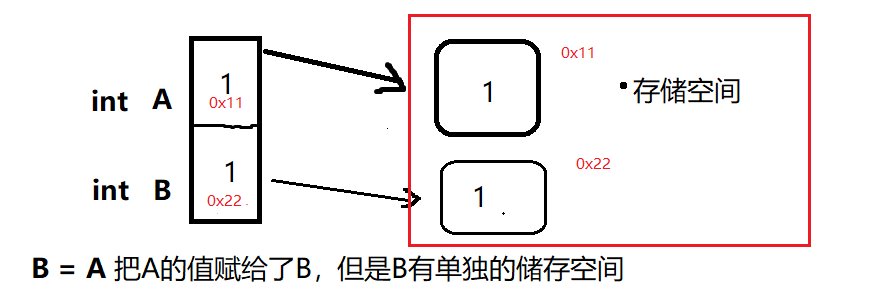

# <center> 武汉科技大学 2022 年机器人团队招新<center/><br>
#### <center> 电控组 笔试试题答题卡<center/><br>
##### <center>姓名：李梓正	学号：202104416238	专业班级：机器人工程2101班
### 一、选择题<br>
|     1     |     2     |     3     |     4     |     5     |
|  :-----:  |  :-----:  |  :-----:  |  :-----:  |  :-----:  |
|     B      |   B        |    C       |  A         |     D      |

|     6     |     7     |     8     |     9     |    10     |
|  :-----:  |  :-----:  |  :-----:  |  :-----:  |  :-----:  |
|    A       |    A       |    B       |    A（平均时间复杂度 ）      |   D        |

### 二、填空题<br>
1、信源<br> 
2、指向name，对其赋值（在结构体中常用，就是调用定义的方法）<br>
3、预处理 编译 汇编 链接<br>
4、先进的，后出来（就是只有一个出口的容器）<br>
5、theta = pow((pow(X,T)*X),(-1)) * pow(X,T) * Y<br>
### 三、综合题<br>
1、（C语言基础素养）`直接在答题卡上作答`<br>
浅拷贝：一种简单的赋值拷贝操作，可以理解为“白嫖”了别人的数据

（在释放内存的时候，B就失效了，在结构体中有如果多次使用浅拷贝，析构函数被调用多次可能会导致程序崩溃）




深拷贝：除了会复制其数据外，还会开辟出属于自己的储存空间，相当于买下来了



2、（C++语言基础）`直接在答题卡上作答，要求有代码高亮`<br>
```cpp
#include <iostream>	
using namespace std;

class cuboid
{
private:
    double cub_a;
    double cub_b;
    double cub_c;
    double cub_area;
    double cub_v;
public:
    void get_cuboid(double a , double b, double c)    //长宽高
    {
        cub_a=a;
        cub_b=b;
        cub_c=c;
    }
    double geta()
    {
        return cub_a;
    }
    double getb()
    {
        return cub_b;
    }
    double getc()
    {
        return cub_c;
    }

    double get_area()
    {
        cub_area = 2*(( cub_a * cub_b ) +(cub_b * cub_c )+(cub_a * cub_c ) );
        return cub_area;
    }
    double getm_volume()
    {
        cub_v = cub_a * cub_b *cub_c;
        return cub_v;
    }


bool compareCube(cuboid &compare) {
    if((cub_a = compare.cub_a) && (cub_b == compare.cub_b) && (cub_c == compare.cub_c)) {
        return true;
    } else if((cub_a = compare.cub_a) && (cub_b == compare.cub_c) && (cub_c == compare.cub_b)) {
        return true;
    } else if((cub_a = compare.cub_b) && (cub_b == compare.cub_a) && (cub_c == compare.cub_c)) {
        return true;
    } else if((cub_a = compare.cub_b) && (cub_b == compare.cub_c) && (cub_c == compare.cub_a)) {
        return true;
    } else if((cub_a = compare.cub_c) && (cub_b == compare.cub_b) && (cub_c == compare.cub_a)) {
        return true;
    } else if((cub_a = compare.cub_c) && (cub_b == compare.cub_a) && (cub_c == compare.cub_b)) {
        return true;
    } else {
        return false;
    }

}

};


void test()
{
    char c;
    int a[1001], n;
    
    
    cuboid cub_1;
    cuboid cub_2;
    cout<<"请输入两个长方体的长,宽,高"<<endl ;
	do{
		scanf("%d", &a[n]);
		n++;	
	}while(c=getchar()!='\n');


    cub_1.get_cuboid(a[0],a[1],a[2]);
    cub_2.get_cuboid(a[3],a[4],a[5]);
    
    if(cub_2.compareCube(cub_1) == true) {
        cout << "两个长方体相等" << endl;
    }
    else{
        cout << "两个长方体不相等" << endl;
    }
}


int main(){

    test();
    system("pause");
    return 0;
}
```
3、（算法）`直接在答题卡上作答，要求有代码高亮`<br>
```c
#include <stdio.h>
#include <stdlib.h>
#include"string.h"
int main(){
    int ans = 0;
    int bit = 0;
    int numsSize;
    int nums[100] = {2，2，2，4};
    numsSize = sizeof(nums)/sizeof(nums[0]);
    for(int i = 31; i >= 0; i--)
    {
        for(int j = 0; j < numsSize; j++)
        {
            bit += nums[j] >> i & 1;
        }
        ans = ans * 2 + bit % 3;
        bit = 0;
    }

    printf("%d ",ans);
    
    system("pause");
    return 0;
}

```
4、（OpenCV）<br>

5、（ROS）<br>


### 四、思考题
1.	请谈谈你对这个比赛的认知及你想通过这个比赛得到什么。`直接在答题卡上作答`<br>1 . 从很早就了解到了robocon这个比赛，被这些“奇特”的机器人模型所吸引，在不大的场地上做一些精彩的任务，慢慢的深入了解，发现这个机器人用到了很多技术，机械，电控，算法等等，一个团队在不到一年的时间里从画出第一个模型，装上第一个轮子，第一次动起来到最后的上场比赛，倾注了很多人一年的心血，希望甚至是精神寄托，这个比赛给了那些努力奋斗，热爱钻研的人一个平台，让他们展示自己，提升自己,在以后可以成长为一名优秀的机器人工程师，这可能就是robocon建立的原因吧。
2 .一个小故事（在我去看今年robocon的赛事规则的时候，下面的一个评论"一个琢磨规则睡不着的roboconer",下面接着一个评论“我也是”），刚接触这个比赛时我就想着以后能不能也参加，去建造一个有一份属于自己的机器人。想去获得这种一群人为了一个目标奋斗的感觉，去获得这样为了调试机器彻夜不眠，待在实验室的感觉，去获得以后说出去我参加过robocon而感到骄傲的感觉。去提升自己的技术，获得一群有相同乐趣的伙伴，收获一份很珍贵的回忆。
<br>

2.	你希望自己在团队中扮演怎样的角色？`直接在答题卡上作答`<br>
在团队中我觉得更多地是一个善始善终的角色，去努力完成好自己的任务，有自己的标准和要求，会想办法去解决问题，自己解决不了就去询问，查询等等，学习算法是一个枯燥乏味的事情，只能慢慢去学习。在平时，我也会担任一个协调凝聚的人，在争吵讨论时可以去调解，愿意去倾听别人的想法。对自己的反省比较多，会更加的照顾伙伴们的感受。
<br>


3.	你期待加入武汉科技大学大学 Robocon 团队的初衷是什么？`直接在答题卡上作答`<br>
最当初了解到这个比赛，纯粹的想法就是自己去参与设计一个机器人，给他装上不同的功能，去跑起来，就像小时候玩的积木玩具一样，谁不想拥有一个这样一个机器人呢。后来慢慢了解，学习到了很多机器人方面的知识，这些只存在于课本或者视频上面的知识，在robocon里可以发挥出来，理论付诸于实践，mc建造世界最后成真的感觉。也知道这个过程非常的困难，经常性的需要熬夜调试，平时的课余时间都奉献给了机器人，但同时我也想学到很多的东西，提升自己的技术，有一群都热爱机器人的朋友在一起是非常美好的事情。平时准备比赛，去压缩自己学习，娱乐的时间，可能到了期末自己的专业课都没有复习完，还在熬夜调试机器人，相对于一些科研竞赛，这个可以说是“吃力不讨好”，但我觉得真正的加入进来后，才能知道自己会收获很多，所以想加入robocon这个团队，没有什么华丽的理由，就是很简单的想法。
<br>

4.	你对机器人行业未来的发展前景有什么见解？`直接在答题卡上作答`<br>
机器人这个行业最早运用在工业上面，一般都是一些机械臂，做一些简单的抓取，重复性的简单工作；随着机器学习和人工智能的发展，逐渐出现了类人型和动物型的机器人，当时了解这个专业时，就看到了无人管理的智能化机器人酒店，海底捞里面的送菜机器人，现在机器人在很多的方面有着飞快的进步，像美国波士顿动力公司的机械狗，双足机器人等技术已经很成熟（头上带个有垂稳的枪加上自动瞄准就可以直接上战场了），中国也有像宇树，大疆，新松等多家机器人产业公司，在以后的各种领域，军事，医疗，工业制造，生活服务等等方面机器人都很有潜力，具有很多的进步空间。在未来，机器人会逐渐代替人工来完成一些重复的任务，上高中就做过“日本黑灯工厂”的题目，就拿疫情来说，如果有一个流程完备的核酸检测系统，让机器人完成测温，数据录入，清洁医疗用品等任务，将会减少很多不必要的麻烦，更加的高效快速。机器人不是某一项技术，而是很多技术的组合体，在以后的信息化数字时代，以前的工业体系就显得很笨重，而“人工智能+机器人”大大提高了效率，完成人类肉体所无法完成的事情，这也算是不断地探索和进步。国家现在正在迈向标准工业化，智能化，努力实现“制造强国”，机器人就是最重要的一个节点。所以机器人这个行业充满了太多的机遇和挑战，有着无限的希望和活力，值得我们一直钻研下去。
<br>


5.	介绍一下最近在学校规定课程之外通过读书或者看网上的资料学到的一项技术知识。`直接在答题卡上作答`<br>
在开始接触时就看到网上很多介绍人工智能和深度学习使用的都是python，就开始自己的学习，看过《python从入门到实践》和《数据结构》，学习了一些基础的算法，参加过相关的算法类竞赛。然后接触到了人脸识别这个项目，知道要学习opencv，就在github上面找一些相关的实战项目，配合着网上的视频教程和官方文档进行学习，逐渐的自己也可以做一些小项目了，像颜色识别，车道线识别，车位统计等等。但是发现学习这个和真正的机器人识别还有很大的差别，就了解到了ros机器人系统，学习到了话题通信（ros更像是一个中间介绍人，连接着你写的程序和机器人），知道了用urdf,rviz,gazebo对机器人进行建模，仿真，在电脑上面让自己设计的机器人动起来，了解到了slan建图，ros和arduino之类的单片机相结合，虽然了解的不深，但是对这些东西很感兴趣，也在逐步的学习中，希望在以后的学习中可以自己做一个ros智能小车。


