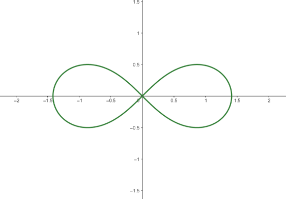

# <center> <font face="宋体">**武汉科技大学 2022 年机器人团队招新**</center>
#### <center> <font face="宋体"> 电控组 笔试试题</center>
###### <p align="right"> <font face="宋体"> 考试时间：8月25日~8月30日</p>
###### <p align="right"> <font face="宋体"> 请在答题卡上作答，在试卷上作答分数不计</p>
##### <center><font face="宋体">姓名：$~~~~~~~~~~~~~~~~~$学号：$~~~~~~~~~~~~~~~~~$专业班级：</center>
>注意：<br>
1、本题目仅供武汉科技大学机器人团队招新使用，归武汉科技大学机器人团队所有<br>
2、本试题涵盖内容较多，请先易后难，做自己会做的，不要抄袭！<br>
3、请把自己最擅长的模块做好（题目没有指定分数，最后选拔也不只是依据成绩来排），许多题目都是开放性题目，把自己想法表达清楚即可。<br>
4、请认真对待思考题！！！
<center><font face="宋体"> ********************祝考试顺利********************</center>

******

### <font face="宋体">一、选择题
1、（面向对象编程）下面哪个不是面向对象的特征？

A、 封装$~~~~~~~~~~~~~~~~~$B、 过程$~~~~~~~~~~~~~~~~~$C、 多态$~~~~~~~~~~~~~~~~~$D、 继承

2、（C++）析构函数的作用是______。

A、开辟一块空间$~~~~~~~~~~~~~~~~~$B、 释放内存$~~~~~~~~~~~~~~~~~$C、销毁变量$~~~~~~~~~~~~~~~~~$D、 结束引用

3、（C++）这段代码的运行结果是：
```cpp
#include <iostream>
using namespace std;
int main(){
    int a = 10;
    int b = 20;
    (a<b?a:b) = 30;
    printf("a= %d, b= %d\n",a,b);
    return 0;
}
```
A、报左值错误$~~~~~~~~~~~~~~~~~$B、报printf错误$~~~~~~~~~~~~~~~~~$C、a= 30,b= 20$~~~~~~~~~~~~~~~~~$D、a= 30,b= 30

4、（Python）Python对文件操作中，如果要在原始内容后方追加内容需要使用______访问模式

A、a$~~~~~~~~~~~~~~~~~$B、r$~~~~~~~~~~~~~~~~~$C、w$~~~~~~~~~~~~~~~~~$D、b

5、（开放题）请选择你最常用的IDE工具：

A、DevC++$~~~~~~~~~~~~~~~~~$B、VS$~~~~~~~~~~~~~~~~~$C、CLion$~~~~~~~~~~~~~~~~~$D、VSCode+插件

6、（OpenCV）下面哪种格式不可以被OpenCV 读取？________。

A、mp4$~~~~~~~~~~~~~~~~~$B、ioc$~~~~~~~~~~~~~~~~~$C、jpg$~~~~~~~~~~~~~~~~~$D、avi

 7、（CMake）下面哪个CMake关键字用于添加非标准的共享库搜索路径？

A、LINK_DIRECTORIES$~~~~~~~~~~~~~~~~~$B、SET

C、INCLUD_DIRECTORIES$~~~~~~~~~~~~~~~~~$D、PROJECT

8、（Lunix）下面哪个命令用于新建文件？

A、mkdir$~~~~~~~~~~~~~~~~~$B、touch$~~~~~~~~~~~~~~~~~$C、sudo $~~~~~~~~~~~~~~~~~$D、echo

9、（数据结构）快速排序的时间复杂度为（）

A.O(nlogn)$~~~~~~~~~~~~~~~~~$B .O(n)$~~~~~~~~~~~~~~~~~$C.O(n2)
$~~~~~~~~~~~~~~~~~$D. O(1)

10、（计算机组成原理）下面哪个不属于CPU的内部结构？

A.ALU$~~~~~~~~~~~~~~~~~$B.PC$~~~~~~~~~~~~~~~~~$C.IR$~~~~~~~~~~~~~~~~~$D.CR


### <font face="宋体">二、填空题
1、（通信知识）：在通信中发送指令的计算机称为_______。

2、对于表达式teacher->name，其作用为______。

3、（编译原理）编译过程分为______、 ______、 ______ 、______四步。

4、（数据结构）入栈出栈规则为______。

5、（机器学习）MSE的矩阵形式是______。


### <font face="宋体">三、综合题
1、（C语言基础素养）请简述C语言中浅拷贝与深拷贝的含义与区别（提示：可以借助图像描述，请使用自己的理解的方式描述，严禁复制定义）<br><br><br><br><br><br>

2、（C++语言基础）请使用分文件的方式编写一个C++长方体类，要求其中包含方法：长方体的体积、长方体的面积、判断两个长方体对象是否全等。<br><br><br><br><br><br>

3、（算法）请自行设计程序，用于找出数组出现1次的数(要求：使用位运算)<br>
例如[1,7,1,5,2,5,0,7,0,0,7,5,1],出现 1 次的数字是 2。<br><br><br><br><br><br>

4、（OpenCV）识别附件中 PlantsVsZombies.mp4 植物射出的子弹(前四种即可，有能力的在左上角标明子弹颜色)。<br><br><br><br><br><br>

5、（ROS）请使用ROS控制小海龟走出如图所示的伯努利双纽线
$$ \rho^2=2a^2cos2\theta \text {，a取1} $$


<br><br><br><br><br><br>

### <font face="宋体">四、思考题

1、请谈谈你对这个比赛的认知及你想通过这个比赛得到什么。<br><br><br><br>

2、你希望自己在团队中扮演怎样的角色？<br><br><br><br>

3、你期待加入武汉科技大学大学 Robocon 团队的初衷是什么？<br><br><br><br>

4、你对机器人行业未来的发展前景有什么见解？<br><br><br><br>

5、介绍一下最近在学校规定课程之外通过读书或者看网上的资料学到的一项技术知识<br><br><br><br>


